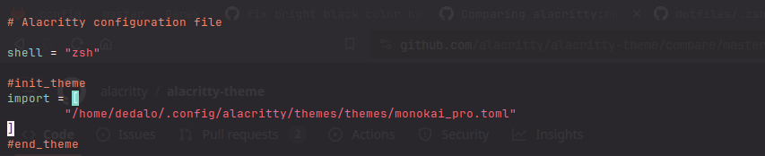

# Alatheme a python script for alacritty fast color theme set.
Its a python script for quickly change of color theme in the terminal of alcritty

## Features of the script
* Allows to change quickly of color themes in a given path
* Show the actual theme that is using
* Show the themes in a given path (all or themes that start by a given name)

## How it works the script
It uses the alacritty configuration file in *"~/.config/alacritty/alacritty.toml"* it searchs for marks the
import of color theme that should be marked by a comment before and after, like it shows in next image.


*Please mark the configuration file as shown in the image above* 
 
So the actual theme is identified by the marks before and  after the import statement of the color theme. 
It searchs for the actual theme and replace with the new one. 
Showing the actual it only finding the actual in the config file. 
Showing the themes, default show theme themes in the path *"~/.config/alacritty/themes/themes/"* with *".toml"* extension (this if de default path because alatheme-themes project specified it).

### Recomendation for use
* Check the default configuration and check if you need some change of paths, the change can be made in the command execution with some flags but if you what it permanet you need to change the script.
* You should add a alias to your *".bashrc"* or shell configuration to execute more quickly, example:
```console
alias alatheme="python3 /full/path/alatheme.py
```

## Example of use

*Show the actual color theme is using:*
```console
alatheme --actual
```

*Show themes in themes path:* (in name use *all* if you want to show all themes or othe *name* for search specific that start with that name:
* For example show themes that start with word github
```console
alatheme --showthemes github
```
* For example show all the themes
```console
alatheme --showthemes all
```

*Change the color theme:* (The given new theme will be searched in the themes path)
```console
alatheme --set newthemename
```
*Example of use*


### Themes
The themes can be found in the official repository of alacritty [alacritty-themes](https://github.com/alacritty/alacritty-theme)
